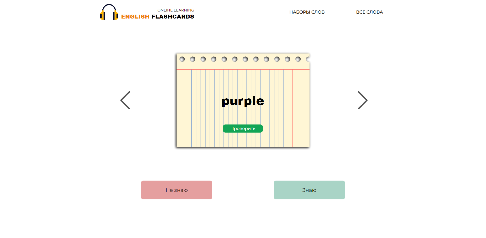

<h1>Language learning flashcards</h1>
<p>a website for learning English words using an effective memorization technique</p>

<p align="left"></p>

<h2>How to make it work?</h2>

1.  Clone the repo:

        git clone https://github.com/neutrinna/Language-learning-flashcards.git
2.  Go to the project folder:

        cd language-learning-flashcards

3.  Install dependencies using:

       ```
        npm install
       ```
4.  Run:
       ```
        npm start
       ```
<h2>Technologies:</h3>
<p align="left">
<a href="https://www.w3.org/html/" target="_blank">  </a>
<a href="https://developer.mozilla.org/en-US/docs/Web/JavaScript" target="_blank" >  </a> 
<a href="https://reactjs.org/" target="_blank" >  </a>
<a href="https://git-scm.com/" target="_blank">  </a>
<a href="https://sass-lang.com" target="_blank" >  </a>
</p>

<h2>Result:</h2>
<a href="https://neutrinna.github.io/Language-learning-flashcards/">Click here ✨</a>
